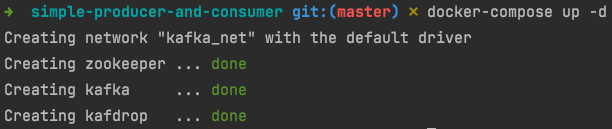
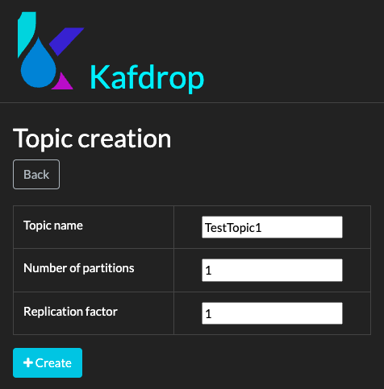
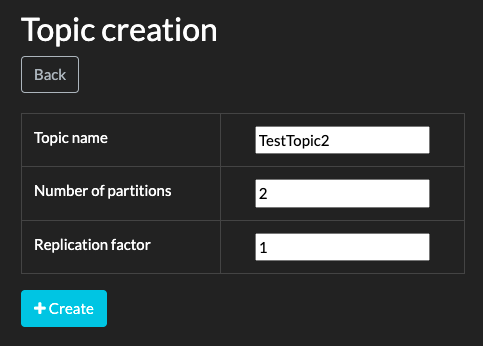
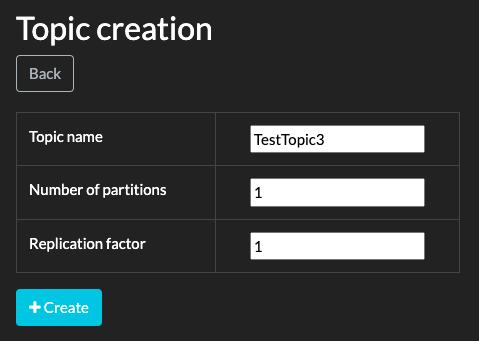
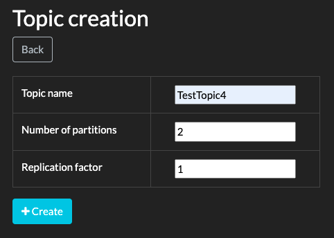

# Analysis of Kafka Consumer

Create below components using the `docker-compose.yml`

1. Zookeeper
2. Kafka Server
3. Kafdrop (UI for Kafka)

```shell
docker-compose up -d
```



1. [One Partition and One Consumer in One Consumer Group](#case-1--one-partition-and-one-consumer-in-one-consumer-group)
2. [Two Partitions and One Consumer in One Consumer Group](#case-2--two-partitions-and-one-consumer-in-one-consumer-group)
3. [One Partition and Two Consumers in One Consumer Group](#case-3--one-partition-and-two-consumers-in-one-consumer-group)
4. [Two Partitions and Two Consumers in One Consumer Group](#case-4--two-partitions-and-two-consumers-in-one-consumer-group)
5. [One Partition and Two Consumers in Different Consumer Groups](#case-5--one-partition-and-two-consumers-in-different-consumer-groups)

## Case 1 : One Partition and One Consumer in One Consumer Group
Create a new topic named **TestTopic1** with **1 partition** from **Kafdrop** UI:



```java
String topics = "TestTopic1";
String consumerGroup1 = "ConsumerGroup1";

Producer producer = new Producer(BOOTSTRAP_SERVERS, topics);
Consumer consumerA = new Consumer("ConsumerA", BOOTSTRAP_SERVERS, consumerGroup1, topics);

(new Thread(producer::produceMessages)).start();
(new Thread(consumerA::consumeMessages)).start();
```

Output:

```
ConsumerA - key: [apple] value: [this is message #0] partition: [0] offset: [0]
ConsumerA - key: [apple] value: [this is message #1] partition: [0] offset: [1]
ConsumerA - key: [apple] value: [this is message #2] partition: [0] offset: [2]
ConsumerA - key: [apple] value: [this is message #3] partition: [0] offset: [3]
ConsumerA - key: [apple] value: [this is message #4] partition: [0] offset: [4]
ConsumerA - key: [apple] value: [this is message #5] partition: [0] offset: [5]
ConsumerA - key: [apple] value: [this is message #6] partition: [0] offset: [6]
ConsumerA - key: [apple] value: [this is message #7] partition: [0] offset: [7]
ConsumerA - key: [apple] value: [this is message #8] partition: [0] offset: [8]
ConsumerA - key: [apple] value: [this is message #9] partition: [0] offset: [9]
```

> **Observation**: As there is only one partition, it is assigned to the single consumer and thus ConsumerA receives all the messages.

## Case 2 : Two Partitions and One Consumer in One Consumer Group
Create a new topic - **TestTopic2** with **2 partitions**:



```java
String topics = "TestTopic2";
String consumerGroup1 = "ConsumerGroup1";

Producer producer = new Producer(BOOTSTRAP_SERVERS, topics);
Consumer consumerA = new Consumer("ConsumerA", BOOTSTRAP_SERVERS, consumerGroup1, topics);
Consumer consumerB = new Consumer("ConsumerB", BOOTSTRAP_SERVERS, consumerGroup1, topics);

(new Thread(producer::produceMessages)).start();

(new Thread(consumerA::consumeMessages)).start();
(new Thread(consumerB::consumeMessages)).start();
```

Output:

```
ConsumerA - key: [apple] value: [this is message #0] partition: [1] offset: [0]
ConsumerA - key: [apple] value: [this is message #1] partition: [1] offset: [1]
ConsumerA - key: [apple] value: [this is message #2] partition: [1] offset: [2]
ConsumerA - key: [apple] value: [this is message #3] partition: [1] offset: [3]
ConsumerA - key: [apple] value: [this is message #4] partition: [1] offset: [4]
ConsumerA - key: [apple] value: [this is message #5] partition: [1] offset: [5]
ConsumerA - key: [apple] value: [this is message #6] partition: [1] offset: [6]
ConsumerA - key: [apple] value: [this is message #7] partition: [1] offset: [7]
ConsumerA - key: [apple] value: [this is message #8] partition: [1] offset: [8]
ConsumerA - key: [apple] value: [this is message #9] partition: [1] offset: [9]
```

> **Observation**: There are 2 partitions and one consumer.
> All the messages have the same partitioning key as `apple` so all the messages go to only one of the two partitions (in this case to partition 1).
> And since there is only one consumer, the partition is assigned to ConsumerA and hence ConsumerA receives all the messages.

## Case 3 : One Partition and Two Consumers in One Consumer Group
Create a new topic - **TestTopic3** with **1 partition**:



```java
String topics = "TestTopic3";
String consumerGroup1 = "ConsumerGroup1";

Producer producer = new Producer(BOOTSTRAP_SERVERS, topics);
Consumer consumerA = new Consumer("ConsumerA", BOOTSTRAP_SERVERS, consumerGroup1, topics);
Consumer consumerB = new Consumer("ConsumerB", BOOTSTRAP_SERVERS, consumerGroup1, topics);

(new Thread(producer::produceMessages)).start();

(new Thread(consumerA::consumeMessages)).start();
(new Thread(consumerB::consumeMessages)).start();
```

Output:

```
ConsumerA - key: [apple] value: [this is message #0] partition: [1] offset: [0]
ConsumerA - key: [apple] value: [this is message #1] partition: [1] offset: [1]
ConsumerA - key: [apple] value: [this is message #2] partition: [1] offset: [2]
ConsumerA - key: [apple] value: [this is message #3] partition: [1] offset: [3]
ConsumerA - key: [apple] value: [this is message #4] partition: [1] offset: [4]
ConsumerA - key: [apple] value: [this is message #5] partition: [1] offset: [5]
ConsumerA - key: [apple] value: [this is message #6] partition: [1] offset: [6]
ConsumerA - key: [apple] value: [this is message #7] partition: [1] offset: [7]
ConsumerA - key: [apple] value: [this is message #8] partition: [1] offset: [8]
ConsumerA - key: [apple] value: [this is message #9] partition: [1] offset: [9]
```

> **Observation**: There is 1 partition and two consumers.
> All the messages have the same key as `apple` so all the messages go to only one of the two partitions (in this case to partition 1).
> The partition is assigned to one of ConsumerA and ConsumerB. In this case ConsumerA receives all the messages.

## Case 4 : Two Partitions and Two Consumers in One Consumer Group
Create a new topic - **TestTopic4** with **2 partitions**:



If the key is same, all the messages will still go to the same partition and hence one out of two consumers will get all the messages.

Let's change the key for every message in the Producer:

```java
producer.send(new ProducerRecord<>(topics, "apple" + i, "this is message #" + i));
```

Consumer:

```java
String topics = "TestTopic4";
String consumerGroup1 = "ConsumerGroup1";

Producer producer = new Producer(BOOTSTRAP_SERVERS, topics);
Consumer consumerA = new Consumer("ConsumerA", BOOTSTRAP_SERVERS, consumerGroup1, topics);
Consumer consumerB = new Consumer("ConsumerB", BOOTSTRAP_SERVERS, consumerGroup1, topics);

(new Thread(producer::produceMessages)).start();

(new Thread(consumerA::consumeMessages)).start();
(new Thread(consumerB::consumeMessages)).start();
```

Output:

```
ConsumerB - key: [apple1] value: [this is message #1] partition: [1] offset: [0]
ConsumerB - key: [apple2] value: [this is message #2] partition: [1] offset: [1]
ConsumerA - key: [apple0] value: [this is message #0] partition: [0] offset: [0]
ConsumerA - key: [apple4] value: [this is message #4] partition: [0] offset: [1]
ConsumerA - key: [apple7] value: [this is message #7] partition: [0] offset: [2]
ConsumerA - key: [apple9] value: [this is message #9] partition: [0] offset: [3]
ConsumerB - key: [apple3] value: [this is message #3] partition: [1] offset: [2]
ConsumerB - key: [apple5] value: [this is message #5] partition: [1] offset: [3]
ConsumerB - key: [apple6] value: [this is message #6] partition: [1] offset: [4]
ConsumerB - key: [apple8] value: [this is message #8] partition: [1] offset: [5]
```

> **Observation**: There are 2 partition and two consumers. Each message has a different key.
> Each message goes to either of two partitions (0 or 1 based on the partitioning logic).
> Partition 0 is assigned to ConsumerA and Partition 1 is assigned to ConsumerB.
> So ConsumerA gets all the messages from Partition 0 and
> ConsumerB gets all the messages from Partition 1.

## Case 5 : One Partition and Two Consumers in Different Consumer Groups
Create a new topic - **TestTopic5** with ** partition**:


Let's keep the same key `apple` for all the messages.

Consumer:

```java
String topics = "TestTopic5";
String consumerGroup1 = "ConsumerGroup1";
String consumerGroup2 = "ConsumerGroup2";

Producer producer = new Producer(BOOTSTRAP_SERVERS, topics);
Consumer consumerA = new Consumer("ConsumerA", BOOTSTRAP_SERVERS, consumerGroup1, topics);
Consumer consumerB = new Consumer("ConsumerB", BOOTSTRAP_SERVERS, consumerGroup2, topics);

(new Thread(producer::produceMessages)).start();

(new Thread(consumerA::consumeMessages)).start();
(new Thread(consumerB::consumeMessages)).start();
```

Output:

```
ConsumerA - key: [apple] value: [this is message #0] partition: [0] offset: [0]
ConsumerA - key: [apple] value: [this is message #1] partition: [0] offset: [1]
ConsumerA - key: [apple] value: [this is message #2] partition: [0] offset: [2]
ConsumerA - key: [apple] value: [this is message #3] partition: [0] offset: [3]
ConsumerB - key: [apple] value: [this is message #0] partition: [0] offset: [0]
ConsumerB - key: [apple] value: [this is message #1] partition: [0] offset: [1]
ConsumerA - key: [apple] value: [this is message #4] partition: [0] offset: [4]
ConsumerA - key: [apple] value: [this is message #5] partition: [0] offset: [5]
ConsumerB - key: [apple] value: [this is message #2] partition: [0] offset: [2]
ConsumerB - key: [apple] value: [this is message #3] partition: [0] offset: [3]
ConsumerB - key: [apple] value: [this is message #4] partition: [0] offset: [4]
ConsumerB - key: [apple] value: [this is message #5] partition: [0] offset: [5]
ConsumerB - key: [apple] value: [this is message #6] partition: [0] offset: [6]
ConsumerB - key: [apple] value: [this is message #7] partition: [0] offset: [7]
ConsumerA - key: [apple] value: [this is message #6] partition: [0] offset: [6]
ConsumerA - key: [apple] value: [this is message #7] partition: [0] offset: [7]
ConsumerA - key: [apple] value: [this is message #8] partition: [0] offset: [8]
ConsumerA - key: [apple] value: [this is message #9] partition: [0] offset: [9]
ConsumerB - key: [apple] value: [this is message #8] partition: [0] offset: [8]
ConsumerB - key: [apple] value: [this is message #9] partition: [0] offset: [9]
```

> **Observation**: There is 1 partition and two consumers in different Consumer Groups.
> All the messages have the same key.
> In this case all the 10 messages will be read by both ConsumerA and ConsumerB because they belong to different Consumer Groups.
> The ordering of the messages is guaranteed in both Consumers because the key is same for each message.
