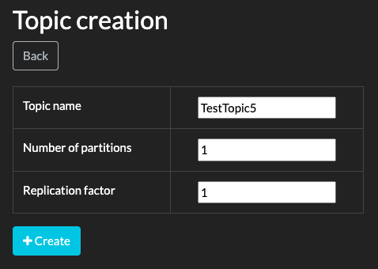

# Analysis of Kafka Consumer and Consumer Group

## What is a Consumer Group?

A consumer group is a group of multiple consumers having the same consumer **group-id**. Every consumer group processes every message in a topic independently from other groups.

It is the collective responsibility of a consumer group to process messages from a given topic. Each consumer within the group will read from one topic partition. Kafka balances the number of partitions across the number of available consumers in the group.

Each consumer group maintains its offset per topic partition.

Consumer groups split the processing load of a topic by sharing its partitions between consumers in a group.

---

Let’s try to understand more about Kafka Consumer and Consumer Group by doing a case by case analysis using a very simple Java application.

Spin up the below required components using the `docker-compose.yml`

1. Zookeeper
2. Kafka Server
3. Kafdrop (UI for Kafka)

```shell
docker-compose up -d
```


1. [Case 1: One Partition, One Consumer in a Consumer Group](#case-1-one-partition-one-consumer-in-a-consumer-group)
2. [Case 2: Two Partitions, One Consumer in a Consumer Group](#case-2-two-partitions-one-consumer-in-a-consumer-group)
3. [Case 3: One Partition, Two Consumers in Same Consumer Group](#case-3-one-partition-two-consumers-in-same-consumer-group)
4. [Case 4: Two Partitions, Two Consumers in Same Consumer Group](#case-4-two-partitions-two-consumers-in-same-consumer-group)
5. [Case 5: One Partition, Two Consumers in Different Consumer Groups](#case-5-one-partition-two-consumers-in-different-consumer-groups)
6. [Conclusion](#conclusion)


## Case 1: One Partition, One Consumer in a Consumer Group

Create a new topic named **TestTopic1** with **1 partition** from **Kafdrop** UI:


```java
String topics = "TestTopic1";
String consumerGroup1 = "ConsumerGroup1";

Producer producer = new Producer(BOOTSTRAP_SERVERS, topics);
Consumer consumerA = new Consumer("ConsumerA", BOOTSTRAP_SERVERS, consumerGroup1, topics);

(new Thread(producer::produceMessages)).start();
(new Thread(consumerA::consumeMessages)).start();
```

Output:

```
ConsumerA - key: [apple] value: [this is message #0] partition: [0] offset: [0]
ConsumerA - key: [apple] value: [this is message #1] partition: [0] offset: [1]
ConsumerA - key: [apple] value: [this is message #2] partition: [0] offset: [2]
ConsumerA - key: [apple] value: [this is message #3] partition: [0] offset: [3]
ConsumerA - key: [apple] value: [this is message #4] partition: [0] offset: [4]
ConsumerA - key: [apple] value: [this is message #5] partition: [0] offset: [5]
ConsumerA - key: [apple] value: [this is message #6] partition: [0] offset: [6]
ConsumerA - key: [apple] value: [this is message #7] partition: [0] offset: [7]
ConsumerA - key: [apple] value: [this is message #8] partition: [0] offset: [8]
ConsumerA - key: [apple] value: [this is message #9] partition: [0] offset: [9]
```

> **Observation**: As there is only one partition, it is assigned to the single consumer and thus ConsumerA receives all the messages.


## Case 2: Two Partitions, One Consumer in a Consumer Group

Create a new topic - **TestTopic2** with **2 partitions**:


```java
String topics = "TestTopic2";
String consumerGroup1 = "ConsumerGroup1";

Producer producer = new Producer(BOOTSTRAP_SERVERS, topics);
Consumer consumerA = new Consumer("ConsumerA", BOOTSTRAP_SERVERS, consumerGroup1, topics);

(new Thread(producer::produceMessages)).start();

(new Thread(consumerA::consumeMessages)).start();
```

Output:

```
ConsumerA - key: [apple] value: [this is message #0] partition: [1] offset: [0]
ConsumerA - key: [apple] value: [this is message #1] partition: [1] offset: [1]
ConsumerA - key: [apple] value: [this is message #2] partition: [1] offset: [2]
ConsumerA - key: [apple] value: [this is message #3] partition: [1] offset: [3]
ConsumerA - key: [apple] value: [this is message #4] partition: [1] offset: [4]
ConsumerA - key: [apple] value: [this is message #5] partition: [1] offset: [5]
ConsumerA - key: [apple] value: [this is message #6] partition: [1] offset: [6]
ConsumerA - key: [apple] value: [this is message #7] partition: [1] offset: [7]
ConsumerA - key: [apple] value: [this is message #8] partition: [1] offset: [8]
ConsumerA - key: [apple] value: [this is message #9] partition: [1] offset: [9]
```

> **Observation**: There are two partitions and one consumer.
> All the messages have the same partitioning key as `apple` so all the messages go to only one of the two partitions (in this case to partition 1).
> And since there is only one consumer, the partition is assigned to ConsumerA and hence ConsumerA receives all the messages.


## Case 3: One Partition, Two Consumers in Same Consumer Group

Create a new topic - **TestTopic3** with **1 partition**:


```java
String topics = "TestTopic3";
String consumerGroup1 = "ConsumerGroup1";

Producer producer = new Producer(BOOTSTRAP_SERVERS, topics);
Consumer consumerA = new Consumer("ConsumerA", BOOTSTRAP_SERVERS, consumerGroup1, topics);
Consumer consumerB = new Consumer("ConsumerB", BOOTSTRAP_SERVERS, consumerGroup1, topics);

(new Thread(producer::produceMessages)).start();

(new Thread(consumerA::consumeMessages)).start();
(new Thread(consumerB::consumeMessages)).start();
```

Output:

```
ConsumerA - key: [apple] value: [this is message #0] partition: [0] offset: [0]
ConsumerA - key: [apple] value: [this is message #1] partition: [0] offset: [1]
ConsumerA - key: [apple] value: [this is message #2] partition: [0] offset: [2]
ConsumerA - key: [apple] value: [this is message #3] partition: [0] offset: [3]
ConsumerA - key: [apple] value: [this is message #4] partition: [0] offset: [4]
ConsumerA - key: [apple] value: [this is message #5] partition: [0] offset: [5]
ConsumerA - key: [apple] value: [this is message #6] partition: [0] offset: [6]
ConsumerA - key: [apple] value: [this is message #7] partition: [0] offset: [7]
ConsumerA - key: [apple] value: [this is message #8] partition: [0] offset: [8]
ConsumerA - key: [apple] value: [this is message #9] partition: [0] offset: [9]
```

> **Observation**: There is one partition and two consumers in the same consumer group.
> This one partition would be assigned to only one consumer and the other consumer will stay idle.
> In this case ConsumerA received all the messages and ConsumerB remained idle.


## Case 4: Two Partitions, Two Consumers in Same Consumer Group

Create a new topic - **TestTopic4** with **2 partitions**:


If the key is same, all the messages will still go to the same partition and hence one out of two consumers will get all the messages.

Let's change the key for every message in the Producer:

```java
producer.send(new ProducerRecord<>(topics, "apple" + i, "this is message #" + i));
```

Consumer:

```java
String topics = "TestTopic4";
String consumerGroup1 = "ConsumerGroup1";

Producer producer = new Producer(BOOTSTRAP_SERVERS, topics);
Consumer consumerA = new Consumer("ConsumerA", BOOTSTRAP_SERVERS, consumerGroup1, topics);
Consumer consumerB = new Consumer("ConsumerB", BOOTSTRAP_SERVERS, consumerGroup1, topics);

(new Thread(producer::produceMessages)).start();

(new Thread(consumerA::consumeMessages)).start();
(new Thread(consumerB::consumeMessages)).start();
```

Output:

```
ConsumerB - key: [apple1] value: [this is message #1] partition: [1] offset: [0]
ConsumerB - key: [apple2] value: [this is message #2] partition: [1] offset: [1]
ConsumerA - key: [apple0] value: [this is message #0] partition: [0] offset: [0]
ConsumerA - key: [apple4] value: [this is message #4] partition: [0] offset: [1]
ConsumerA - key: [apple7] value: [this is message #7] partition: [0] offset: [2]
ConsumerA - key: [apple9] value: [this is message #9] partition: [0] offset: [3]
ConsumerB - key: [apple3] value: [this is message #3] partition: [1] offset: [2]
ConsumerB - key: [apple5] value: [this is message #5] partition: [1] offset: [3]
ConsumerB - key: [apple6] value: [this is message #6] partition: [1] offset: [4]
ConsumerB - key: [apple8] value: [this is message #8] partition: [1] offset: [5]
```

> **Observation**: There are two partitions and two consumers. Each message has a different key.
> Each message goes to either of two partitions (0 or 1 based on the partitioning logic).
> Partition 0 is assigned to ConsumerA and Partition 1 is assigned to ConsumerB.
> So ConsumerA gets all the messages from Partition 0 and
> ConsumerB gets all the messages from Partition 1.


## Case 5: One Partition, Two Consumers in Different Consumer Groups

Create a new topic - **TestTopic5** with **1 partition**:



Let's keep the same key `apple` for all the messages.

Consumer:

```java
String topics = "TestTopic5";
String consumerGroup1 = "ConsumerGroup1";
String consumerGroup2 = "ConsumerGroup2";

Producer producer = new Producer(BOOTSTRAP_SERVERS, topics);
Consumer consumerA = new Consumer("ConsumerA", BOOTSTRAP_SERVERS, consumerGroup1, topics);
Consumer consumerB = new Consumer("ConsumerB", BOOTSTRAP_SERVERS, consumerGroup2, topics);

(new Thread(producer::produceMessages)).start();

(new Thread(consumerA::consumeMessages)).start();
(new Thread(consumerB::consumeMessages)).start();
```

Output:

```
ConsumerA - key: [apple] value: [this is message #0] partition: [0] offset: [0]
ConsumerA - key: [apple] value: [this is message #1] partition: [0] offset: [1]
ConsumerA - key: [apple] value: [this is message #2] partition: [0] offset: [2]
ConsumerA - key: [apple] value: [this is message #3] partition: [0] offset: [3]
ConsumerB - key: [apple] value: [this is message #0] partition: [0] offset: [0]
ConsumerB - key: [apple] value: [this is message #1] partition: [0] offset: [1]
ConsumerA - key: [apple] value: [this is message #4] partition: [0] offset: [4]
ConsumerA - key: [apple] value: [this is message #5] partition: [0] offset: [5]
ConsumerB - key: [apple] value: [this is message #2] partition: [0] offset: [2]
ConsumerB - key: [apple] value: [this is message #3] partition: [0] offset: [3]
ConsumerB - key: [apple] value: [this is message #4] partition: [0] offset: [4]
ConsumerB - key: [apple] value: [this is message #5] partition: [0] offset: [5]
ConsumerB - key: [apple] value: [this is message #6] partition: [0] offset: [6]
ConsumerB - key: [apple] value: [this is message #7] partition: [0] offset: [7]
ConsumerA - key: [apple] value: [this is message #6] partition: [0] offset: [6]
ConsumerA - key: [apple] value: [this is message #7] partition: [0] offset: [7]
ConsumerA - key: [apple] value: [this is message #8] partition: [0] offset: [8]
ConsumerA - key: [apple] value: [this is message #9] partition: [0] offset: [9]
ConsumerB - key: [apple] value: [this is message #8] partition: [0] offset: [8]
ConsumerB - key: [apple] value: [this is message #9] partition: [0] offset: [9]
```

> **Observation**: There is one partition and two consumers in different Consumer Groups.
> All messages have the same key.
> In this case all the 10 messages will be read by both ConsumerA and ConsumerB because they belong to different Consumer Groups.
> The ordering of the messages is guaranteed in both Consumers because the key is same for each message.


## Conclusion

1. If multiple messages are sent with the same key then, ordering is guaranteed at the consumer side because all messages will be sent to the same partition.
2. If messages have different keys then, ordering is not guaranteed at the consumer side.
3. We can scale our message consumption by increasing our consumer instances to the number of partitions on the topic. This is the approach suggested by Kafka for doing _parallel processing_.
4. If we scale our consumer instances beyond the number of partitions then the excess consumers will remain idle.
5. Same partition will never be assigned to two active consumers belonging to the same consumer group.
